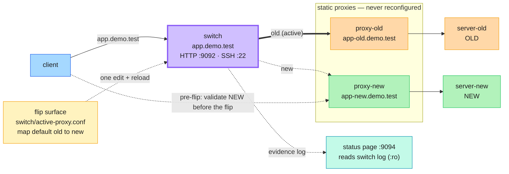

# Architecture — v2.0 Two-Proxy Switch Topology

This is the reference for how the demo is wired **as of v2.0**. It is organised by
subject, read out of order. Running the demo? Read [`../WALKTHROUGH.md`](../WALKTHROUGH.md)
— that is the script, in order, with the exact commands.

For the original single-proxy design, check out git tag `v1.0`.

---

## Overview — a blue-green proxy tier

v1 flipped a hostname by editing the upstream inside **one** proxy and reloading it.
v2 keeps that exact mechanism — one word, one reload — but moves it up a layer into a
**blue-green proxy tier**.

A front **`switch`** is the client's only endpoint (`app.demo.test`). It forwards to one
of **two static proxies** — `proxy-old` (always → `server-old`) and `proxy-new` (always →
`server-new`). The static proxies are **never reconfigured during the demo**; the only
thing that ever changes is a single word in the switch's map. That one edit flips **both**
HTTP on `:9092` and SSH on `:22`, because the switch's `http` and `stream` blocks share the
same map file.

What the extra layer buys, that v1 could not do:

- **Pre-flip validation** — hit `app-new.demo.test` directly to prove the new stack is live
  over both protocols *before* committing to the cutover, while live traffic still lands on OLD.
- **Instant rollback** — flip the switch back, no teardown of any container.
- **"The old proxy is never touched"** — a verifiable `shasum -a 256`, not a claim.



Solid line = the **active** path (selector on `old`). Dashed = the standby path and the
observability/validation edges.

---

## Components

### `switch` — the client's only endpoint

The one thing the client ever talks to, aliased **`app.demo.test`**. It listens on
`:9092` (HTTP) and `:22` (SSH `stream`), and it plays three roles at once:

- **The flip surface.** Its config `include`s `switch/active-proxy.conf` in *both* the
  `http` and `stream` contexts. That file is a one-line `map` selecting `old` or `new`.
- **The router.** `proxy_pass` resolves the selector to an upstream group — `proxy-old` or
  `proxy-new` — for whichever protocol the request arrived on.
- **The evidence writer.** It owns the read-write `demo-logs` volume and writes the JSON
  evidence line the status page reads. Because the client hits the switch directly, the
  switch sees the client's **real** `remote_addr`.

### The two static proxies — never reconfigured

`proxy-old` and `proxy-new` are transparent, single-upstream nginx instances:

| Proxy | Alias | HTTP upstream | SSH upstream |
|-------|-------|---------------|--------------|
| `proxy-old` | `app-old.demo.test` | `server-old:80` | `server-old:22` |
| `proxy-new` | `app-new.demo.test` | `server-new:80` | `server-new:22` |

They are configured **once** and never touched again for the life of the demo — that is what
makes "the old proxy is never touched" literally true (and checksum-verifiable). Crucially,
**neither proxy sets any identity header of its own**: the backend's `X-Backend` passes
through untouched, so no proxy tier can forge which backend answered.

Their own `app-*.demo.test` aliases are what make **pre-flip validation** possible — you can
reach `proxy-new` directly, bypassing the switch, before the flip.

### The backends — `server-old` (OLD) / `server-new` (NEW)

Two backends built from **one image**, differing only in an identity env var. Each serves
HTTP and accepts SSH, and each states its own identity — `OLD` or `NEW` — in its HTTP
`X-Backend` header and its SSH login banner. Unchanged from v1.

### `status` — the projected evidence page (`:9094`)

A small read-only service that reads the switch's evidence log (`:ro`) and the selector file,
and renders the current selection plus recent requests — each row showing the client's real
`remote_addr` and the backend that answered. It has **no** dependency on the switch, so it
still renders `UNAVAILABLE` if the front tier dies — it is most valuable exactly then.

---

## The flip

The cutover is one word in one file, then a graceful reload:

```sh
# switch/active-proxy.conf
map $server_port $active_backend {
    default old;      # change 'old' to 'new'
}
```

```sh
make flip-new     # edits the line + nginx -s reload on the switch
```

The switch includes that **same** map file in both its `http` and its `stream` block. An nginx
`map` is valid in both contexts (an `upstream` group is not — hence one map file, two upstream
groups). So a single edit + reload flips **HTTP:9092 and SSH:22 together** — one edit, both
protocols, no restart. This is decision **D-39**.

Rolling back is the same move in reverse (`make flip-old`) — instant, with no teardown.

---

## Request flows

**Normal traffic (client-transparent).**
`client → switch (app.demo.test) → proxy-{old|new} → server-{old|new}`.
The client uses the same hostname and ports before and after the flip; only the switch's
selector changed.

**Pre-flip validation (bypasses the switch).**
`client → app-new.demo.test → proxy-new → server-new`. This proves the new stack is live over
both HTTP and SSH *while* `app.demo.test` still lands on OLD. Driven by `make verify-new-stack`.

**Rollback.**
`make flip-old` returns both protocols to OLD by reloading only the switch. No container is
recreated or reloaded — verified by unchanged container `StartedAt` and nginx worker PIDs.

**Evidence integrity.**
The backend emits its own `X-Backend` identity header. It rides back **untouched** through the
static proxy and the switch (nginx passes upstream response headers through, and no proxy adds
its own), so the value the switch logs is the backend's own word — `OLD` or `NEW` — asserted by
no proxy tier. A forged `backend=NEW` is therefore not possible from any intermediate hop.

---

## Key properties

- **Client-transparent.** Same hostname, same ports, same commands across the cutover.
- **The static proxies are never touched.** Byte-identical configs before, during, and after
  a full cutover-and-rollback cycle — a `shasum -a 256` triple-equality, corroborated by
  unchanged container start times and worker PIDs.
- **Evidence cannot be forged.** No proxy tier sets an identity header; the switch logs the
  backend's own `X-Backend`.
- **Loopback-bound only.** Every host-published port is bound to `127.0.0.1`; the two static
  proxies publish nothing (internal-only). The rig is never offered to conference wifi.
- **No host `:22`.** The switch's SSH listener is reached container-to-container over the
  Docker network — container port 22 is published nowhere (D-15).
- **No Docker socket.** Mounted nowhere; the tier that *reports* evidence (`status`) reads it
  through a read-only shared volume and provably cannot alter it.
- **v1 is preserved.** The original single-proxy demo remains runnable at git tag `v1.0`.

---

## Where things live

| Path | What |
|------|------|
| `compose.yaml` | The whole rig: `switch`, `proxy-old`, `proxy-new`, `server-old`, `server-new`, `status`, `client` |
| `switch/nginx.conf` | The switch: `http` (9092/9093/8081) + `stream` (22), both including the shared map |
| `switch/active-proxy.conf` | **The only file the presenter edits** — the one-line selector |
| `proxy-old/nginx.conf`, `proxy-new/nginx.conf` | The static, single-upstream proxies (HTTP + inert SSH stream) |
| `status/status.py` | The evidence page — reads the switch log `:ro`, renders the client IP |
| `scripts/flip.sh` | The flip helper (`make flip-new` / `make flip-old`) |
| `scripts/verify.sh` | `make verify` (through the switch) and `make verify-new-stack` (pre-flip, direct to `app-new`) |
| `scripts/smoke.sh` | The full assertion suite (`make test`) |
